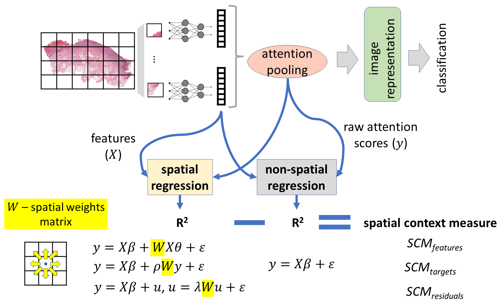

# Deep Spatial Context (*DSCon*)
The official implementation of the *DSCon* method which serves for the investigation of the attention-based vision models from the perspective of the concept of spatial context. The investigation is performed using the proposed three <ins>S</ins>patial <ins>C</ins>ontext <ins>M</ins>easures: *SCMfeatures*, *SCMlabels*, *SCMresiduals*. \
The *DSCon* method was introduced in *`Deep spatial context: when attention-based models meet spatial regression'* by Paulina Tomaszewska, El¿bieta Sienkiewicz, Mai P. Hoang, Przemys³aw Biecek.

This repository is built on top of the repository (https://github.com/mahmoodlab/CLAM) with the implementation of the CLAM model which served as a canvas for experiments with *DSCon* method. In the files within CLAM directory the changes were made to meet the needs of the experiments i.e by enabling use of the transformer-based models as backbone. 
